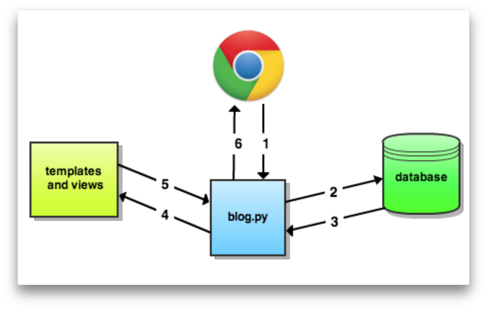

# Flask Blog App
- После логина пользователь видит посты.
- Пользователь может читать/добавлять текстовые посты или разлогинится.



## Шаблоны
Фласк по умолчанию идет с шаблонизатором [Jinja 2](http://jinja.pocoo.org/docs/2.10/). [Статья](https://realpython.com/blog/python/primer-on-jinja-templating/) для старта.

## Логин
Секретный ключ для сессии должен быть неугадываемым. Лучше генерировать его средствами OS в REPL:

```bash
>>> import os
>>> os.urandom(24)
b'\xd5_MqzK\x99R\xdf\x18\xc0\x9aInl\x9f5Q5NE\x02;\xca'
```

`urandom(24)` строковое представление 24-х рандомных байтов, используя средства ОС. Специально сделано для криптографических нужд.

Вот это будет нормальный ключ:

```python
SECRET_KEY = b'\xd5_MqzK\x99R\xdf\x18\xc0\x9aInl\x9f5Q5NE\x02;\xca'
```


